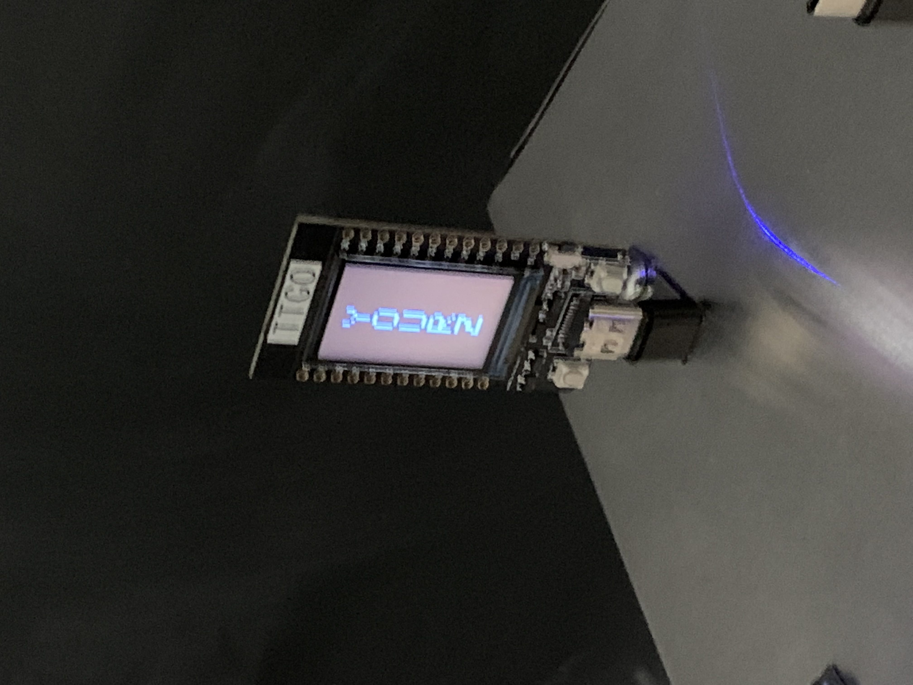
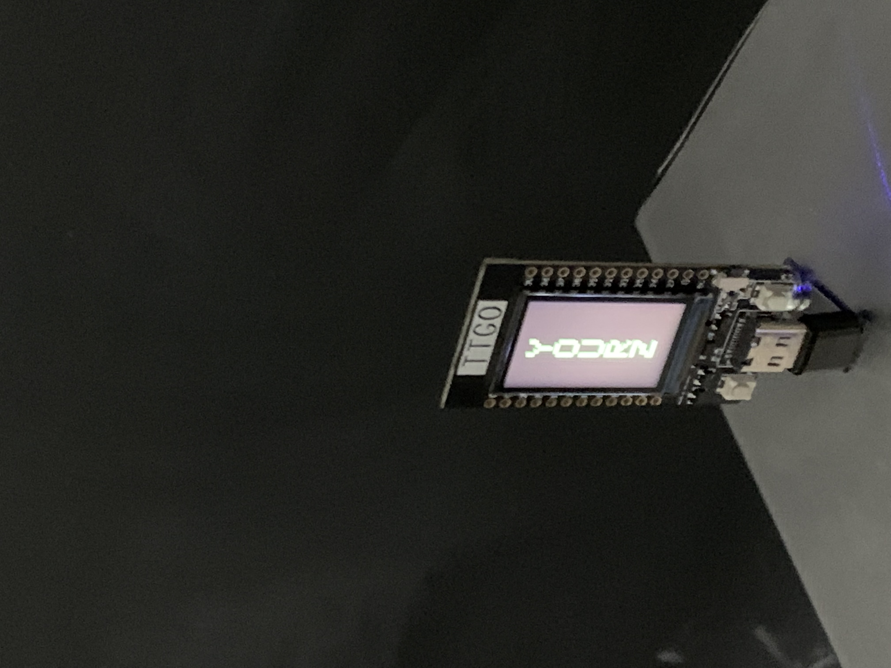
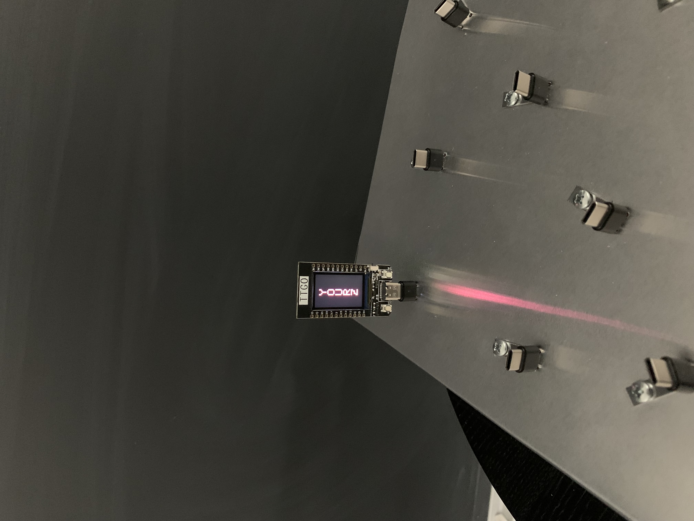

Setup Instructions for Love_Yourz

Creating the exhibit requires a couple of steps. The first is to download the Arduino software, in my case,
I needed to download the Legacy version, an older version of the software. Once it is downloaded and running,
go to file->preferences and then enable the esp32 board by inserting this url where it says additional boards manager:
https://dl.espressif.com/dl/package_esp32_index.json

Then go to Tools->Boards->ESP32 Arduino and select TTGO T1. In order to select a port, make sure that the ESP32
is connected to the your machine using a data transfer USB-C cable. In my case, I needed to download the following driver
and reset my machine in order to get the code to load on my ESP32.
http://www.wch.cn/downloads/CH34XSER_MAC_ZIP.html

For those that also need to download the driver, select the port /dev/cu.wchusbserial.

It is also required to install the TFT_eSPI library by Bodmer. This can be done by going to Tools->Library Manager.

Once all of the prepation is done, you can upload the code found in Love_Yourz.ino to the ESP32. The file can be
found in the following Git Repository.
https://github.com/aot2109/Module1 